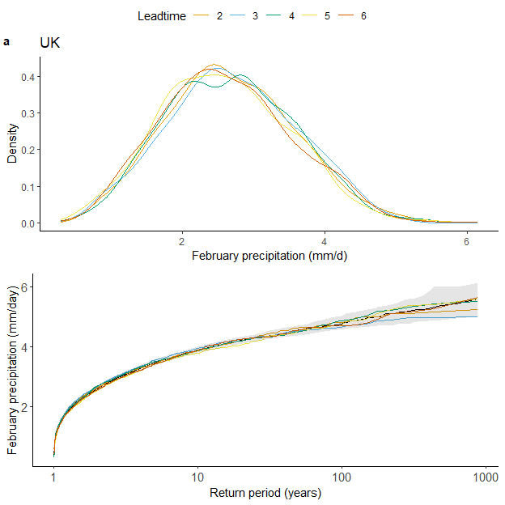

2.3 Stability
================
Timo Kelder
June 8, 2020

In this notebook, we will test the model stability of SEAS5.

## Import data and packages

The data is downloaded from CDS. see the Notebooks of the first step of
the workflow. In notebook [2.1Convert](2.1Convert.md), we load the SEAS5
and EOBS netcdf files and convert them to dataframes, that can be used
in R. Here, we load the dataframes.

``` r
EOBS_UK_weighted_df <- read.csv("../../Data/EOBS_UK_weighted_df.csv", row.names = 1)
SEAS5_UK_weighted_df <- read.csv("../../Data/SEAS5_UK_weighted_df.csv", row.names = 1)
```

SEAS5 contains:

  - Member: 0-24
  - Year: 1982-2016
  - Leadtime: 2-6

<!-- end list -->

``` r
# Colorblind friendly palette with black:
# Source: http://www.cookbook-r.com/Graphs/Colors_(ggplot2)/#a-colorblind-friendly-palette
# I select five colors and put black at the end.
cbPalette <- c("#E69F00", "#56B4E9", "#009E73", "#F0E442", "#D55E00", "#000000") # , "#0072B2", "#CC79A7")

### The Leadtime column has to be a factor for a grouped plot
SEAS5_UK_weighted_df$Leadtime <- as.factor(SEAS5_UK_weighted_df$Leadtime)


p1 <-
  ggplot(SEAS5_UK_weighted_df, aes(x = Precipitation, colour = Leadtime)) +
  ggtitle("UK") +
  labs(x = "February precipitation (mm/d)", y = "Density") +
  geom_line(stat = "density") +
  theme_classic() +
  theme(legend.position = "none") +
  scale_colour_manual(values = cbPalette) #+
theme(
  text = element_text(size = 11),
  axis.text = element_text(size = 11),
  plot.title = element_text(hjust = 0.5)
)
```

    ## List of 3
    ##  $ text      :List of 11
    ##   ..$ family       : NULL
    ##   ..$ face         : NULL
    ##   ..$ colour       : NULL
    ##   ..$ size         : num 11
    ##   ..$ hjust        : NULL
    ##   ..$ vjust        : NULL
    ##   ..$ angle        : NULL
    ##   ..$ lineheight   : NULL
    ##   ..$ margin       : NULL
    ##   ..$ debug        : NULL
    ##   ..$ inherit.blank: logi FALSE
    ##   ..- attr(*, "class")= chr [1:2] "element_text" "element"
    ##  $ axis.text :List of 11
    ##   ..$ family       : NULL
    ##   ..$ face         : NULL
    ##   ..$ colour       : NULL
    ##   ..$ size         : num 11
    ##   ..$ hjust        : NULL
    ##   ..$ vjust        : NULL
    ##   ..$ angle        : NULL
    ##   ..$ lineheight   : NULL
    ##   ..$ margin       : NULL
    ##   ..$ debug        : NULL
    ##   ..$ inherit.blank: logi FALSE
    ##   ..- attr(*, "class")= chr [1:2] "element_text" "element"
    ##  $ plot.title:List of 11
    ##   ..$ family       : NULL
    ##   ..$ face         : NULL
    ##   ..$ colour       : NULL
    ##   ..$ size         : NULL
    ##   ..$ hjust        : num 0.5
    ##   ..$ vjust        : NULL
    ##   ..$ angle        : NULL
    ##   ..$ lineheight   : NULL
    ##   ..$ margin       : NULL
    ##   ..$ debug        : NULL
    ##   ..$ inherit.blank: logi FALSE
    ##   ..- attr(*, "class")= chr [1:2] "element_text" "element"
    ##  - attr(*, "class")= chr [1:2] "theme" "gg"
    ##  - attr(*, "complete")= logi FALSE
    ##  - attr(*, "validate")= logi TRUE

We want to show the confidence interval of the distribution of all lead
times pooled together, and test whether the individual lead times fall
within these confidence intervals. Therefore we bootstrap the pooled
leadtimes into series with equal length of the individual leadtimes
(875), with n=10000.

``` r
Leadtime_length <- sum(SEAS5_UK_weighted_df$Leadtime == 2)
bootstrapped_series <- sample(SEAS5_UK_weighted_df$Precipitation, size = Leadtime_length * 10000, replace = T) # bootstraps the series of length equal to each lead time (875) with n= 10.000
bootstrapped_array <- array(bootstrapped_series, dim = c(Leadtime_length, 10000)) # Creates an array with 10.000 series of 875 values

CI <- function(x) {
  quantile(x, probs = c(0.025, 0.975)) ## lower and upper interval
}
```

We plot the empirical return values of the pooled ensemble including
confidence intervals. On top, we add the individual lead times.

``` r
rps <- 35 * 25 * 5 / 1:(35 * 25 * 5) # The return periods for the entire ensemble of 4,375‬ years
rps_ld <- 35 * 25 / 1:(35 * 25) # The return periods for the ensemble split up into 5 leadtimes, 875 years

empirical_returnvalues <- function(x) { ## write a function to obtain the quantiles for the distribution
  return(quantile(x, probs = 1 - 1 / (rps))) # returns the quantiles for the return values = (1-1/return period)
}

Rvs <- apply(bootstrapped_array, MARGIN = 2, empirical_returnvalues) # apply the function to each of the 10.000 series

# calculate the lower and upper interval from the 10.000 values for each quantile.
ci_rvs <- apply(Rvs, MARGIN = 1, CI)
# png(paste0('//home/timok/timok/SALIENSEAS/SEAS5/ensex/statistics/multiday/plots/Stability_rv.png'),type='cairo')

## Create a dataframe including the return peridos, empirical values and confidence intervals
df_quantiles <- SEAS5_UK_weighted_df %>%
  mutate(rps_all = rps, quantiles_all = quantile(Precipitation, 1 - 1 / (rps)))

df_quantiles <- df_quantiles %>%
  group_by(Leadtime) %>%
  mutate(rps_ld = rps_ld, quantiles_ld = quantile(Precipitation, 1 - 1 / (rps_ld)))

df_quantiles$ci_2.5 <- ci_rvs[1, ]
df_quantiles$ci_97.5 <- ci_rvs[2, ]
```

``` r
# And plot!
cols <- c("95 % CI" = "black")
p2 <-
  ggplot(df_quantiles) +
  geom_line(aes(x = rps_all, y = quantiles_all)) +
  geom_line(aes(x = rps_ld, y = quantiles_ld, col = Leadtime)) +
  geom_ribbon(aes(x = rps_all, ymin = ci_2.5, ymax = ci_97.5, fill = "95 % CI"), alpha = 0.1) +
  # xlim(NA,875)+
  scale_x_log10(limits = c(NA, Leadtime_length)) +
  # scale_x_continuous(trans='log10') +
  theme_classic() +
  theme(legend.position = "none") +
  scale_fill_manual(name = "Pooled data", values = cols) +
  scale_colour_manual(values = cbPalette) +
  xlab("Return period (years)") +
  ylab("February precipitation (mm/day)") +
  theme(
    text = element_text(size = 11),
    axis.text = element_text(size = 11)
  )
```

## And then combine the plots for publication

``` r
# Combine the plots

ggarrange(p1, p2,
  labels = c("a", "b"), # , "c", "d"),
  hjust = c(-0.5, 1, -0.5, 1),
  ncol = 1, nrow = 2,
  font.label = list(size = 11, color = "black", face = "bold", family = NULL),
  common.legend = TRUE
) # %>%
```

    ## Warning: Removed 4 rows containing missing values (geom_path).

<!-- -->

``` r
# ggsave(filename = "../../graphs/Stability.pdf", width = 120, height = 180, units='mm')

## For presentation
# ggarrange(p1, p2,
#         labels = c("a", "b"),
#         hjust = c(-0.5,1,-0.5,1),
#         ncol = 2, nrow = 1,
#         font.label = list(size = 14, color = "black", face ="bold", family = NULL),
#         common.legend = TRUE) %>%
#   ggsave(filename = "../graphs/Stability_pptfont14.png", width = 180, height = 110, units='mm')
```
