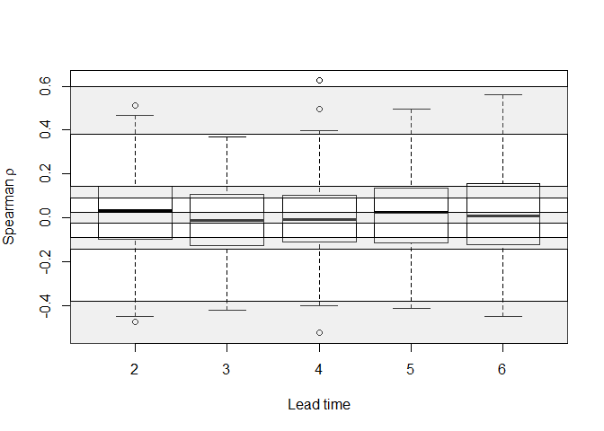

2.1Independence
================
Timo Kelder
June 4, 2020

In this notebook, we test whether the ensemble members are independent,
based on UNSEEN-trends (ref todo).

## Import data and packages

The data is downloaded from CDS. see the Notebooks of the first step of
the workflow. In notebook [2.1Convert](2.1Convert.md), we load the SEAS5
and EOBS netcdf files and convert them to dataframes, that can be used
in R. Here, we load the dataframes.

``` r
EOBS_UK_weighted_df = read.csv('../../Data/EOBS_UK_weighted_df.csv',row.names = 1)
SEAS5_UK_weighted_df = read.csv('../../Data/SEAS5_UK_weighted_df.csv',row.names = 1)
```

SEAS5 contains:

  - Member: 0-24
  - Year: 1982-2016
  - Leadtime: 2-6

An example how SEAS5 can be indexed:

``` r
##Indexing the data
member = 0 #(0:24) 
leadtime = 2 #2:6
Member0_ld2 = SEAS5_UK_weighted_df$Precipitation[SEAS5_UK_weighted_df$Member == member & SEAS5_UK_weighted_df$Leadtime == leadtime]
Member1_ld2 = SEAS5_UK_weighted_df$Precipitation[SEAS5_UK_weighted_df$Member == member + 1 & SEAS5_UK_weighted_df$Leadtime == leadtime]
```

\#\#Indepence testing between the first en second member

See the paper: this is an example of testing between two members.

``` r
#Test the correlation Between Use spearman to avoid normality assumptions
cor_coeff='spearman'
correlation=cor.test(Member0_ld2,Member1_ld2,alternative = 'two.sided',method = cor_coeff) 

##And plot the correlation for these two members
par(mar=c(4.5,5.1,2.1,2.1),cex.axis=1.5, cex.lab=1.5,cex.main=1.5)
plot(Member0_ld2,Member1_ld2, xlim=c(min(Member0_ld2,Member1_ld2),max(Member0_ld2,Member1_ld2)),ylim=c(min(Member0_ld2,Member1_ld2),max(Member0_ld2,Member1_ld2)),
     xlab='Leadtime 2 member 00 (mm)', ylab='Leadtime 2 member 01 (mm)')
lines(c(0,6),c(0,6))
text(2 * min(Member0_ld2,Member1_ld2),0.8*max(Member0_ld2,Member1_ld2),
     bquote(atop("Spearman" ~ rho== .(round(correlation$estimate,digits = 3)),
                 'p value' == .(round(correlation$p.value,digits = 3)))),cex=1.3)
legend("bottomright", legend=c("1:1 line"),lty=1,cex=1.3)
```

<!-- -->

## Independence testing for all ensemble members

In total, there are 300 distinct pairings for each lead time. Here we
calculate the ρ values for each pair.

``` r
Independence_test <- function(ensemble) {
  
##Perform the pairwise test
correlations_lds=array(dim = c(25,25,5),dimnames = list(as.character(0:24),as.character(0:24),as.character(2:6))) # create and array to fill the correlations in 
#lds, mbmrs
for (ld in 2:6){
  for (mbr1 in 0:24){ ####Number 24 is missing!!
    for (mbr2 in 0:24){
        
      if (mbr1>mbr2){ ## Only calculate this for the top half of the correlation matrix, as not to duplicate any values -> avoid correlating mbr 1 with mbr2 and then mbr2 with mbr 1.
        predictant = ensemble$Precipitation[ensemble$Member == mbr1 & ensemble$Leadtime == ld]
        predictor = ensemble$Precipitation[ensemble$Member == mbr2 & ensemble$Leadtime == ld]

        correlations_lds[as.character(mbr1),as.character(mbr2),as.character(ld)] = cor(predictant,predictor,method = cor_coeff)
      }
    }
  }
}

#Check where the correlation is the same as the one estimated in the previous chunk
# correlations_lds['1','0','7']==correlation$estimate

##And plot the result
par(mar=c(4.5,5.1,2.1,2.1),cex.axis=1.5, cex.lab=1.5,cex.main=1.5)
boxplot(list(correlations_lds[,,'2'],correlations_lds[,,'3'],correlations_lds[,,'4'],correlations_lds[,,'5'],correlations_lds[,,'6']),
        # range=0, #box whiskers to be the data extremes
        xaxt="n",xlab='Lead time',ylab=bquote('Spearman'~rho))
Axis(side=1,at=1:6,labels = c(as.character(2:6),'all'))

return(correlations_lds)
}

correlations_lds = Independence_test(ensemble = SEAS5_UK_weighted_df)
```

<!-- -->

## Bootstrap test

To test whether the correlations are significant, we perform a bootstrap
test.

This takes long to runnn\!\!\!\!\!

``` r
#The correlation test is complex.
#Step one: we test one member to another member, n= length of record over years. For example, we have 35 data point, one for each year, over 1982-2016. n=35
# ensemble = SEAS5_UK_weighted_df$Precipitation
# n = 35 

Bootstrap_step1 <- function(ensemble,n) {
  ensemble_resampled1=sample(x=ensemble, size=n, replace = TRUE) #First, resample to make the data uncorrelated
  ensemble_resampled2=sample(x=ensemble, size=n, replace = TRUE) #First, resample to make the data uncorrelated
  return(cor(ensemble_resampled1,ensemble_resampled2,method = cor_coeff))
}

##Step two: We perform this test for each distinct member. We have 25 members, making 300 distinct pairs. 
#We have to replicate this in the bootstrap. So we repeat step one 300 times. 
Bootstrap_step2 <- function(ensemble, n) {
  distinct_ensembles = (25-1)*25/2 #300
  cors = replicate(distinct_ensembles,Bootstrap_step1(ensemble = ensemble, n = n))
  return(unlist(boxplot(cors,range=0, #box whiskers to be the data extremes
                        plot = F)$stats))
}

correlations_boxstats = replicate(10000,Bootstrap_step2(ensemble = SEAS5_UK_weighted_df$Precipitation, n = 35))

Quantiles=c(0.025,0.975)
Quantiles_fun <- function(x) {quantile(x,Quantiles,na.rm=T)}
CI_bounds_boxplots=apply(correlations_boxstats[,,], MARGIN = 1, Quantiles_fun ) #We resample 1000 times for 4 leadtimes. Resulting in 4000 quantiles based on 300 pairs of correlations. 

saveRDS(CI_bounds_boxplots, file = "../../Data/CI_bounds_boxplots.rds")
# readRDS(file = "my_data.rds")
```

## Plot

``` r
##And plot
## Load the data from the previous chunk
CI_bounds_boxplots <- readRDS(file = "../../Data/CI_bounds_boxplots.rds")


# pdf('../../graphs/Independence.pdf',width = 10, height = 4)

# par(mfrow=c(1,2),mar=c(4.5,5.1,2.1,2.1),cex.axis=1.5, cex.lab=1.5,cex.main=1.5)
boxplot(list(correlations_lds[,,'2'],correlations_lds[,,'3'],correlations_lds[,,'4'],correlations_lds[,,'5'],correlations_lds[,,'6']),
        # range=0, #box whiskers to be the data extremes
        xaxt="n",xlab='Lead time',ylab=bquote('Spearman'~rho))
for (i in 1:length(CI_bounds_boxplots[1,]))  {
  polygon(c(0,6,6,0),c(rep(CI_bounds_boxplots[1,i],2),rep(CI_bounds_boxplots[2,i],2)),col=gray(0.8,alpha=0.3))}
Axis(side=1,at=1:6,labels = c(as.character(2:6),'all'))
```

<!-- -->

``` r
# dev.off()
```
